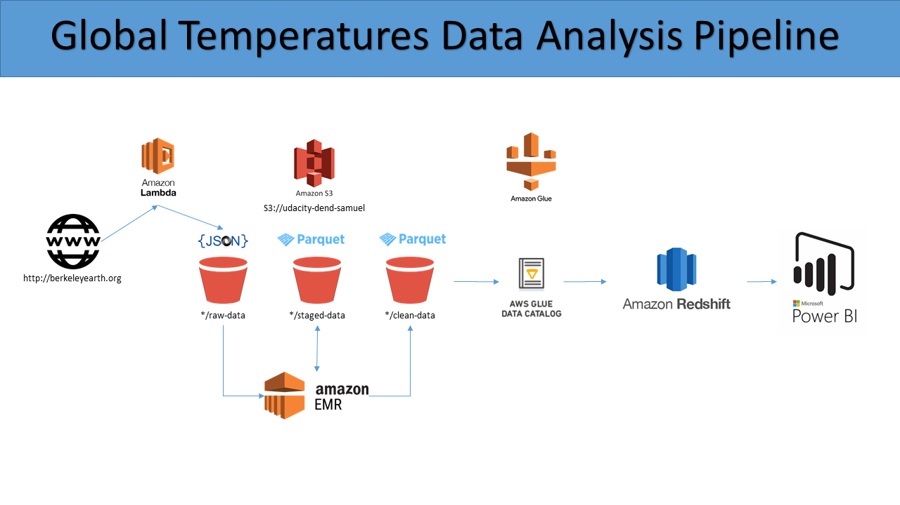

# Global Temperatures Data Pipeline Documentation
Final Capstone project of Udacity Data Engineering Nanodegree. 

## Tools and Technologies
**AWS Lambda**

This is the first data ingestion service of choice since I can allocate on demand EC2 instances to run a python script design to request the text file from http://berkeleyearth.lbl.gov/.

For example, the Lambda function can get the response from the latest text file and wrangle the data into a json file for the new month appended/partitioned by month in s3.

```python
import requests
url = "http://berkeleyearth.lbl.gov/auto/Global/Complete_TAVG_complete.txt"
response = requests.get(url)
```

**AWS EMR**

This is the second data ingestion/pre-processing service of choice since I can create a cluster of master/worker nodes with Spark, Hive, and Livy so we can aggregate, transform, and clean the data.

As data gets bigger, we are using Spark to clean and impute data into the dataset.

The following script contains the cleaning python code in pyspark:

[data-cleaning.py](https://github.com/sammyrod/global-temp/blob/master/data-cleaning.py)

**S3**

This is the data storage service of choice, since it is cheap and scalable. By converting the files to parquet format and setting retention (or deep storage such as Glaxcier) policies for raw and staging files, we can manage to control cost and scale.

**Redshift Spectrum**

It will be used to conduct the data quality checks and as the endpoint to visualization tools. By utilizing the power of clusters and parrallel processes, redshift spectrum can read data directly from our storage service of choice, which is s3.

The following script represent the Airflow cleaning section of the dag:

airflow/operators.py
```python
from airflow.hooks.postgres_hook import PostgresHook
from airflow.models import BaseOperator
from airflow.utils.decorators import apply_defaults

class NullQualityOperator(BaseOperator):
    ui_color = '#89DA59'

    @apply_defaults
    def __init__(self,
                 redshift_conn_id,
                 table_name,
                 grouping,
                 *args, **kwargs):

        super(DataQualityOperator, self).__init__(*args, **kwargs)
        self.redshift_conn_id = redshift_conn_id
        self.table_name = table_name
        self.grouping = grouping

    def execute(self, context):
        redshift = PostgresHook(postgres_conn_id=self.redshift_conn_id)
        table_name = self.table_name
        grouping = self.grouping
        null_exist_query = f"""
            SELECT 
                SUM(CASE WHEN LandAverageTemperature IS NULL THEN 1 ELSE 0 END) AS null_LandAverageTemperature
            FROM {table_name}
            """
        null_exist_query2 = f"""
            SELECT 
                SUM(CASE WHEN LandAverageTemperatureUncertainty IS NULL THEN 1 ELSE 0 END) AS null_LandAverageTemperatureUncertainty
            FROM {table_name}
            """
        
        dupliate_exist_query = f"""
            WITH duplicates AS (
                SELECT 
                    dt
                FROM {table_name}
                GROUP BY {grouping}
                HAVING COUNT(1) > 1
            )
            SELECT COUNT(1) AS duplicate_count
            FROM duplicates
        """
        
        self.log.info(f"Conducting data quality on table {table_name}")
        records = redshift.get_records(null_exist_query)
        records2 = redshift.get_records(null_exist_query2)
        duplicate = redshift.get_records(dupliate_exist_query)
        
        if len(records) < 1 or len(records[0]) < 1:
            raise ValueError(f"Data quality check failed. The {table_name} table might have no data.")
        
        num_records = records[0][0]        
        if num_records > 0:
            raise ValueError(f'There are LandAverageTemperature nulls in the {table_name} table.') 
            
        if len(records2) < 1 or len(records2[0]) < 1:
            raise ValueError(f"Data quality check failed. The {table_name} table might have no data.")
        
        num_records = records2[0][0]        
        if num_records > 0:
            raise ValueError(f'There are LandAverageTemperatureUncertainty nulls in the {table_name} table.')   
            
        if len(duplicate) < 1 or len(duplicate[0]) < 1:
            raise ValueError(f"Data quality check failed. The {table_name} table might have no data.")
        
        num_records = duplicate[0][0]        
        if num_records > 0:
            raise ValueError(f'There are duplicates in the {table_name} table.') 
```

Here is how the dag will be initiated: 
```python
from airflow.operators import DataQualityOperator     

run_quality_checks = DataQualityOperator(
    task_id='global_check_nulls_and_duplicates',
    dag=dag,
    redshift_conn_id="redshift",
    table_name="spectrum.GlobalTemperatures",
    grouping="dt"
)

run_quality_checks = DataQualityOperator(
    task_id='country_check_nulls_and_duplicates',
    dag=dag,
    redshift_conn_id="redshift",
    table_name="spectrum.GlobalLandTemperaturesByCountry",
    grouping="dt, Country"
)
```

## Data Gathering and Update Schedule

**Data Gathering Steps**
Since http://berkeleyearth.org updates the source data on a montly basis, and we need to analyze the data as soon as it is available, we are updating the data on a monhtly basis.

## Elastic Data Handling Approach
In the event where data is increased by 100x, we are ready to scale by using spark clusters. We can increase the specs of the worker nodes as necessary or provide more worker nodes to handle the data. We could also setup autoscaling for our EMR spark clusters. Redshift can also handle the data at scale in a similar manner. We can scale up the clusters.

Using Redshift Spectrum can allow more than 100+ people to access the data. Users will be able to query the data from redshift using their own credentials as the redshift admin can create users and permissions to schemas and tables for each user. To create these users the redshift admin will use the CREATE USER command. As more users query data from redshift, we will have to scale up the clusters.

The dashboards will be ready to be populated before 7am each morning since the data will be ready to go in the parquet-clean key of the s3 bucket. A Airflow dag will orchestrate the process shown below in the data model. The PowerBi dashboard will be updated every day at 7am. By this time, the Airflow process will be done.

##### Dag Task 1: AWS Lmabda Crawler
> We are extracting data from the website using a Python request package. The outputs will be parsed as csv documents that will be stored in S3.

##### Dag Task 2: Glue Spark Job or EMR Spark Job to Read Csv
> The CSV data will be read using spark into a spark dataframe in EMR memory.

##### Dag Task 3: Glue Spark Job or EMR Spark Job to Convert to Parquet
> The EMR dataframe in memory is then converted to parquet to consume less resources when conducting transformations and cleaning activities. This step is separated from the rest because we would like to know if the transformation was succesful and the cleaning script runs without any issues. It would also let us know if we have already extracted the same date by the partition provided.

##### Dag Task 4: EMR Job to Read Parquet and Clean Data
> We are reading the parquet files and conducting the cleaning on parquet data since it is more efficient. This task will conbine reading parquet and celaning because we are not expecting the reading part to fail. On the contrary, we can expect the cleaning part to fail. Therefore we will know that the cleaning script needs to be evaluated for quality.

##### Dag Task 5: A Postgress Hook queries the data and checks for quality
> In this task we are doing to determine if the data is ready for downstream consumption and meets the quality requirements agreed. It is a separate task because we need to make sure that our downstream users are not consuming the wrong data.

##### Dag Task 6: EMR Spark Job to Dump Clean Data and Crawled for Downstream
> Here we are dumping the data that passess quality checks into the final bucket that will be catalogued using Glue and read using Redshift Spectrum as the endpoint of the visualization tool.

> A Glue crawler will catalog the clean data after it is dumped in the destination s3 object/key.

## Data Model
The data model is as follows: 



Here is a more linear representation of the process:

1. Data is crawled form original  http://berkeleyearth.org website using AWS Lambda
2. Data is dumped into a s3 bucket in csv format in s3://world-temp-data/csv-files
3. Data is read using a spark cluster using pyspark and converted into parquet in s3://world-temp-data/parquet-staging
4. Data is read using a spark cluster using pyspark and transformed/cleaned
5. Data is check for null values and duplicates using a spark cluster
6. Quality checks are conducted:
    a. If data pass all quality checks, it is dumped into into s3://world-temp-data/parquet-clean as parquet
    b. If data does not pass quality checks, the error is sent by email to users and the process stops
7. A Glue crawler catalogs the parquet files in s3://world-temp-data/parquet-clean as parquet in the Glue global_temp database
8. Redshift Spectrum refers to the clean-data table in the global_temp database in a global_temp_db redshift database
9. Power BI connects to Redshift and extracts the clean-data table from the global_temp_db using a Redshift Driver.
